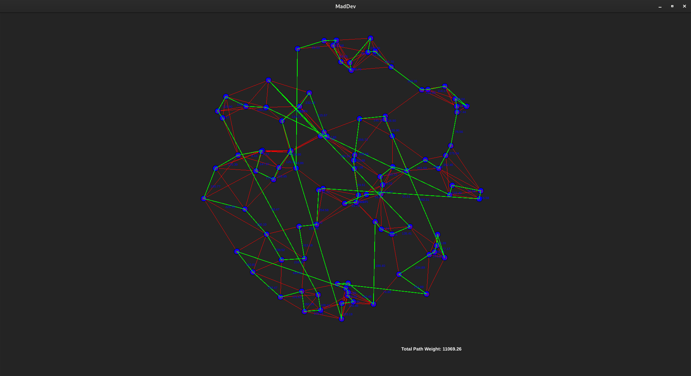

# MadDev

Чтобы запустить нужны следующие зависимости:

sudo apt-get install qt6-base-dev qt6-tools-dev qt6-tools-dev-tools

Задача:
- Построить граф из 100 случайно сгенерированных точек, расположенных внутри окружности.
- Соединить точки таким образом, чтобы каждая точка имела как минимум 2 и как максимум 6 соседей.
- Используя граф, найти маршрут с минимальной стоимостью, который:
  - Начинается с выбранной пользователем вершины.
  - Покрывает все точки графа.
  - Возвращается в начальную вершину.
  - Стоимость маршрута пропорциональна расстоянию между вершинами.
  - Единица расстояния - 10 USDT

## Генерация графа:
Каждая вершина соединена минимум с 2 и максимум с 6 соседями. Это обеспечивает связность графа при корректной генерации рёбер.
## Алгоритм:
Алгоритм "Ближайший сосед" не гарантирует оптимальное решение задачи коммивояжёра, но даёт приближённый результат.
Поскольку граф связный, жадный алгоритм обходит все вершины.
Если в графе есть изолированные вершины, решение невозможно. Однако, генерация рёбер в программе гарантирует отсутствие изолированных вершин.
## Визуализация:
Все вершины и рёбра графа отображаются корректно.
Путь отображается с подсветкой, а его стоимость рассчитывается как сумма весов рёбер.

Для запуска на linux (debian 12):
```
git clone git@github.com:Bonartze/MadDev.git
mkdir build && cd build && cmake ../ && make -j`nproc`
```

# Пример вывода:

